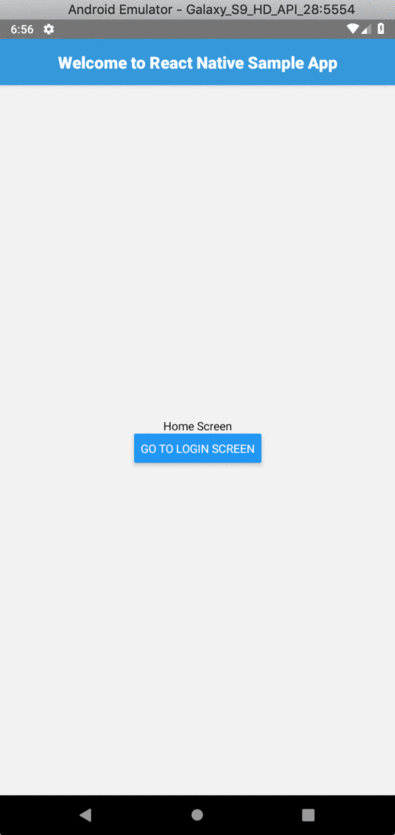

# ReactNativeSampleApp
A sample React Native App

# Build the App
First you need to run `yarn`.

Second step is to run `yarn start` so the packager will start

Third step run `yarn android` and have an emulator up and running 

